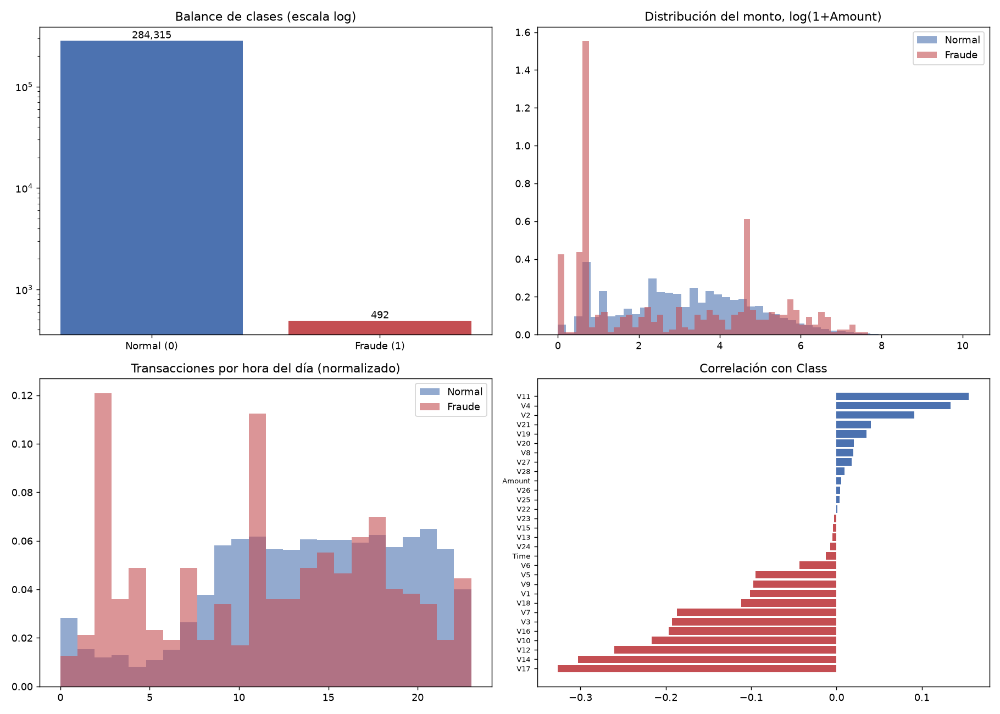
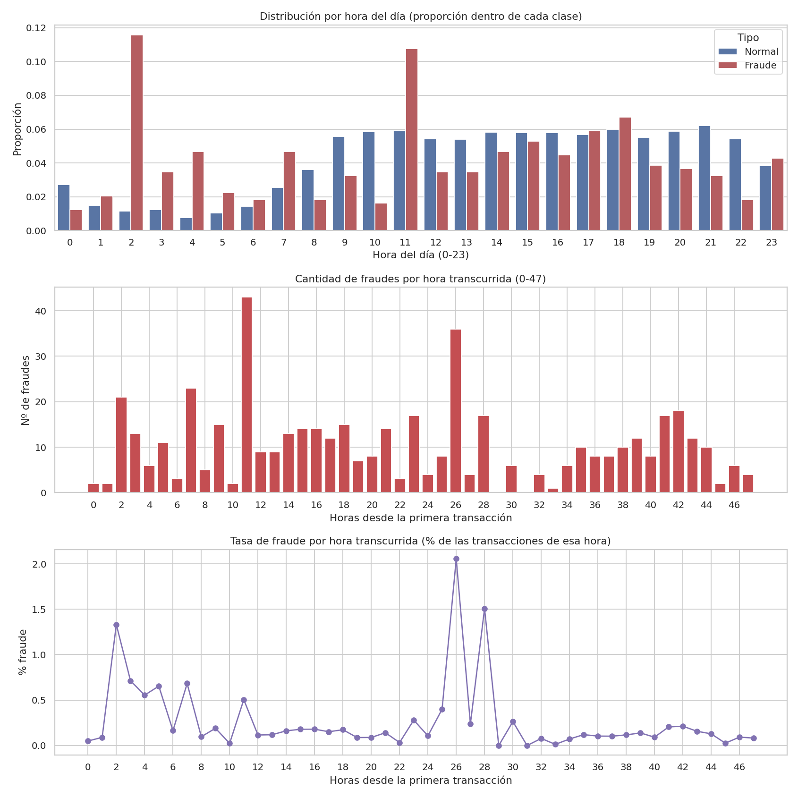

# credit-card-fraud-exploratory-analysis
credit-card-fraud-exploratory-analysis 
[README.md](https://github.com/user-attachments/files/33037036/README.md)
# Análisis Exploratorio de Riesgo y Patrones de Fraude en Transacciones Financieras

## Resumen del Proyecto

Análisis exploratorio sobre **284.807 transacciones anonimizadas de tarjetas de crédito** (492 fraudes, 0,17 % del total) para identificar patrones de comportamiento fraudulento en **monto** y **horario**.

El dataset es el conocido *Credit Card Fraud Detection* (ULB Machine Learning Group, disponible en Kaggle): transacciones de titulares europeos a lo largo de dos días. Las variables `V1` a `V28` son componentes de un PCA, por lo que no tienen interpretación directa; `Time` son los segundos desde la primera transacción y `Amount` es el monto.

## Hallazgos Clave de Negocio

* **Comportamiento del monto:** el 50 % de los fraudes no supera los **9,25** (mediana), frente a una mediana de 22,00 en las transacciones normales. El promedio de los fraudes (122,21) es más alto que el de las normales (88,29), pero lo empujan pocos casos grandes: el fraude típico es de monto bajo. Esto es consistente con la hipótesis de que se busca pasar por debajo de los umbrales de alerta, aunque los datos por sí solos no permiten confirmar esa intención.
* **Ventanas de alto riesgo:** las **11:00 hs** (hora transcurrida 11) concentran el mayor volumen absoluto de fraudes (43), pero también mucho tráfico normal, por lo que su tasa es baja (0,51 %). El riesgo relativo se dispara en la madrugada, en las horas transcurridas **2 y 26** (las 2:00 AM de cada día, si se asume que `Time = 0` es medianoche), con tasas de fraude de **1,33 % y 2,06 %**, es decir, aproximadamente 8 y 12 veces la tasa global.

## Visualizaciones





## Limitaciones

* `Time` es relativo a la primera transacción; la lectura de "madrugada" supone que el registro arranca a medianoche, algo que el dataset no confirma.
* Cubre solo dos días, así que cada hora del día aparece dos veces. Algunas horas tienen pocos casos (por ejemplo, 21 fraudes en la hora 2), por lo que los picos conviene tomarlos como señales a validar, no como conclusiones firmes.
* Las variables `V1`-`V28` están anonimizadas, lo que limita la interpretación de negocio.
* El dataset contiene 1.081 filas duplicadas que no se eliminaron en este análisis exploratorio.
* El análisis es descriptivo: no se construyó ningún modelo predictivo.

## Stack Utilizado

Python (Pandas, Seaborn, Matplotlib), con apoyo de herramientas LLM/IA para la optimización de los scripts de exploración.

## Estructura del Repositorio

```
├── README.md
├── explorar_creditcard.py     # carga, resumen y vista general
├── fraude_por_hora.py         # análisis de fraude por hora
├── images/
│   ├── vista_general_creditcard.png
│   └── fraude_por_hora.png
└── .gitignore
```

## Cómo reproducirlo

1. Descargá el dataset `creditcard.csv` desde Kaggle (*Credit Card Fraud Detection*) y guardalo en la raíz del proyecto. **No está incluido en el repositorio** por su tamaño (~150 MB).
2. Instalá las dependencias: `pip install pandas seaborn matplotlib`
3. Ejecutá `python explorar_creditcard.py` y luego `python fraude_por_hora.py`.
